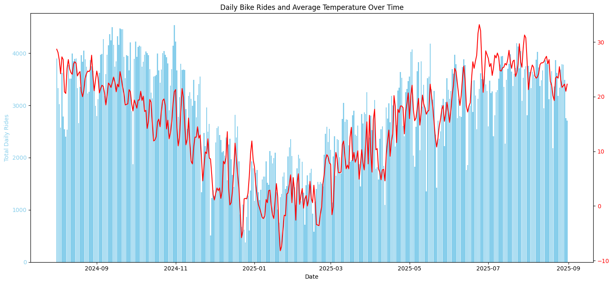
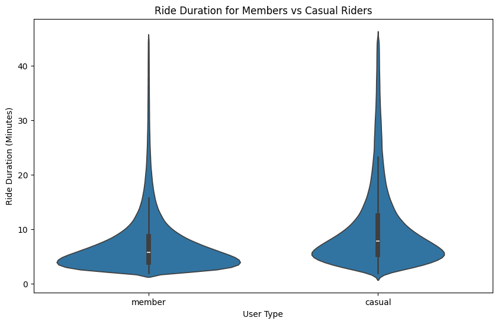
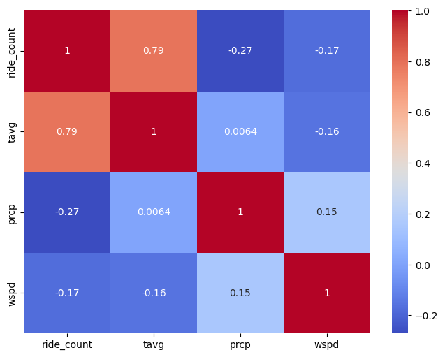
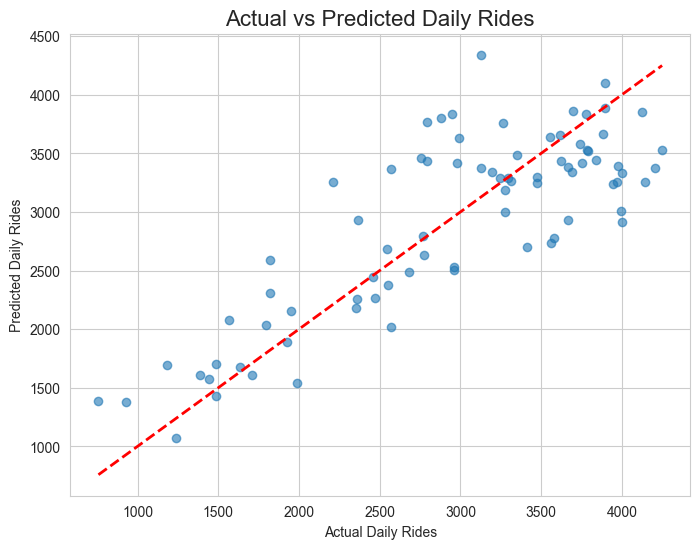

# README.md

## NYC Bike Rental: An Analysis of Ridership vs. Weather

This project explores the relationship between weather conditions and bike share ridership in New York City from August 2024 to August 2025. Using public data from CitiBikeNYC and historical weather data, this analysis aims to identify the key factors that influence rental demand and uncover different patterns of usage between annual members and casual riders.

## Data Sources
- Bike Data: https://citibikenyc.com/system-data
- Weather Data: Sourced via the Meteostat Python library

## How to run this notebook

1. clone this repo

`git clone https://github.com/aaron576/bike_project.git`

2. open the project folder in VSCode

3. From the Bike Data source download JC-202408-citibike-tripdata.csv.zip through JC-202508-citibike-tripdata.csv.zip. Extract them into /data/raw

4. create and activate a virtual environment

`python -m venv venv`

`.\venv\Scripts\activate`

5. Install the required packages

`pip install -r requirements.txt`

6. In VSCode open bike_project.ipynb

7. Run all

## Key Visualizations

